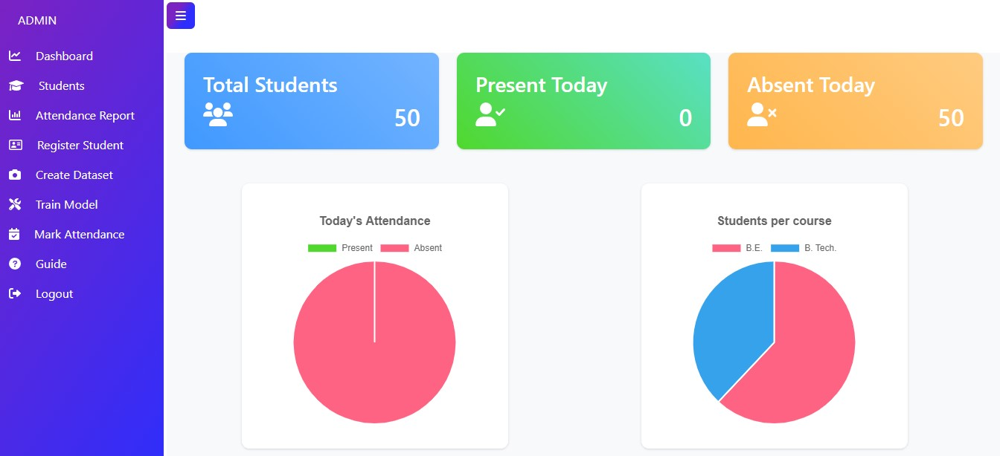

[](https://github.com/Minal-singh/SAMS/actions/workflows/SAMS.yml)

# Student Attendance Management System Created Using Django

[Project Demo on YouTube]

And if you like this project, then ADD a STAR ⭐️  to this project 👆

## Features of this Project

### A. Admin Users Can
1. Register new student
2. Manage Students (Update and Delete)
3. View Student Attendance
4. Create dataset for students
5. Train Model
6. Mark Attendance
7. Export attendance sheet based on required filters
8. Help student for password recovery

### B. Students Can
1. View Attendance
2. Change password


## 📸 ScreenShots

**Login Page**


**Admin Portal**

AdminDashboard

StudentsPage

AttendancePage

RegisterPage


**Student Portal**

StudentDashboard

StudentAttendancePage


## How to Install and Run this project?

### Pre-Requisites:
1. Install Git Version Control
[ https://git-scm.com/ ]

2. Install Python Latest Version
[ https://www.python.org/downloads/ ]

3. Install Pip (Package Manager)
[ https://pip.pypa.io/en/stable/installing/ ]

*Alternative to Pip is Homebrew*

### Installation
**1. Create a Folder where you want to save the project**

**2. Create a Virtual Environment and Activate**

Install Virtual Environment First
```
$  pip install virtualenv
```

Create Virtual Environment

For Windows
```
$  python -m venv venv
```
For Mac
```
$  python3 -m venv venv
```
For Linux
```
$  virtualenv .
```

Activate Virtual Environment

For Windows
```
$  source venv/scripts/activate
```

For Mac
```
$  source venv/bin/activate
```

For Linux
```
$  source bin/activate
```

**3. Clone this project**
```
$  git clone https://github.com/Minal-singh/SAMS
```

Then, Enter the project
```
$  cd SAMS
```

**4. Install Requirements from 'requirements.txt'**

For Windows
```
$  pip install https://github.com/Minal-singh/dlib/blob/master/dlib-19.23.0-cp39-cp39-win_amd64.whl?raw=true
$  pip install cmake
$  pip install -r requirements.txt
```
For Linux and Mac
```python
$  pip3 install -r requirements-linux.txt
```

**5. Collect Static**

Command for Windows:
```python
$ python manage.py collectstatic --no-input
```

Command for Mac:
```python
$ python3 manage.py collectstatic --no-input
```

Command for Linux:
```python
$ python3 manage.py collectstatic --no-input
```

**6. Now Run Server**

Command for Windows:
```python
$ python manage.py makemigrations main_app
$ python manage.py migrate
$ python manage.py runserver
```

Command for Mac:
```python
$ python3 manage.py makemigrations main_app
$ python3 manage.py migrate
$ python3 manage.py runserver
```

Command for Linux:
```python
$ python3 manage.py makemigrations main_app
$ python3 manage.py migrate
$ python3 manage.py runserver
```

**7. Login Credentials**

**Use Default Credentials**

*For Admin*
Email: admin@admin.com
Password: admin

*For Student*
Email: wmougeot0@businesswire.com
Password: password

**or create**
Create Super User
Command for Windows:
```
$  python manage.py createsuperuser
```

Command for Mac:
```
$  python3 manage.py createsuperuser
```

Command for Linux:
```
$  python3 manage.py createsuperuser
```
