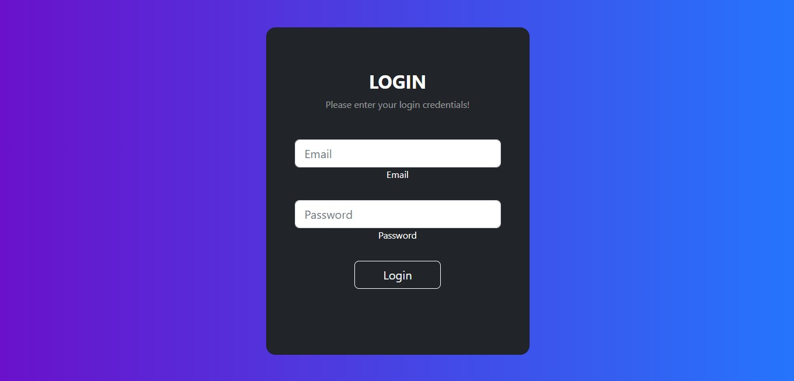
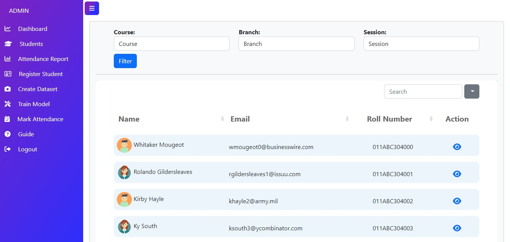
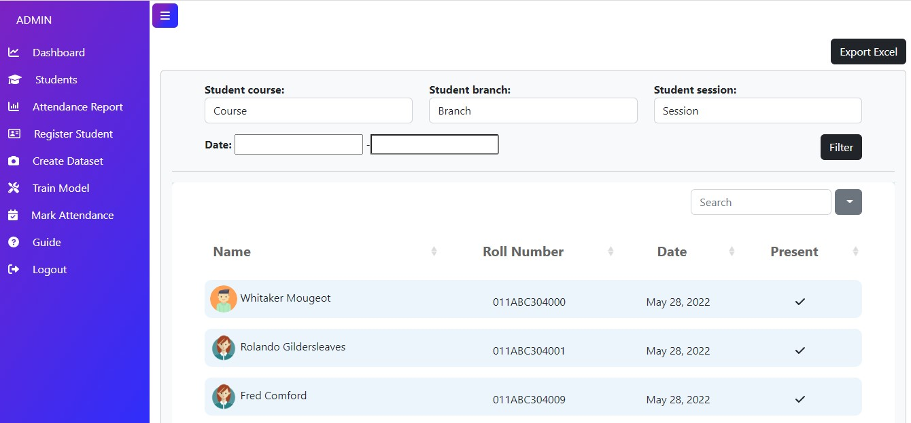
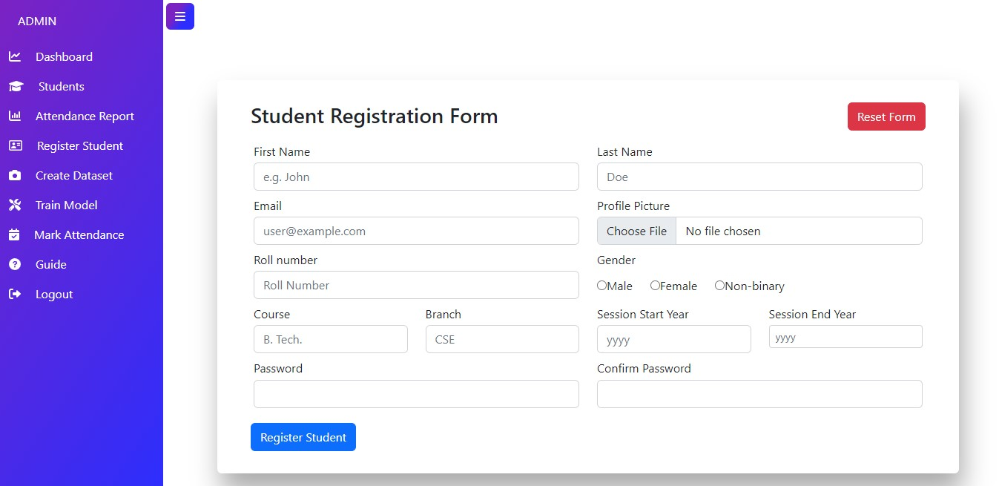
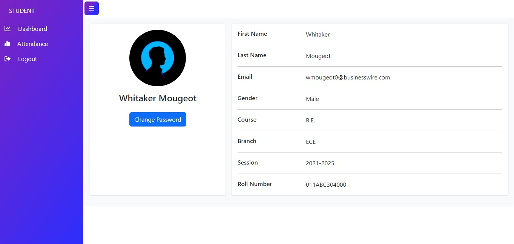
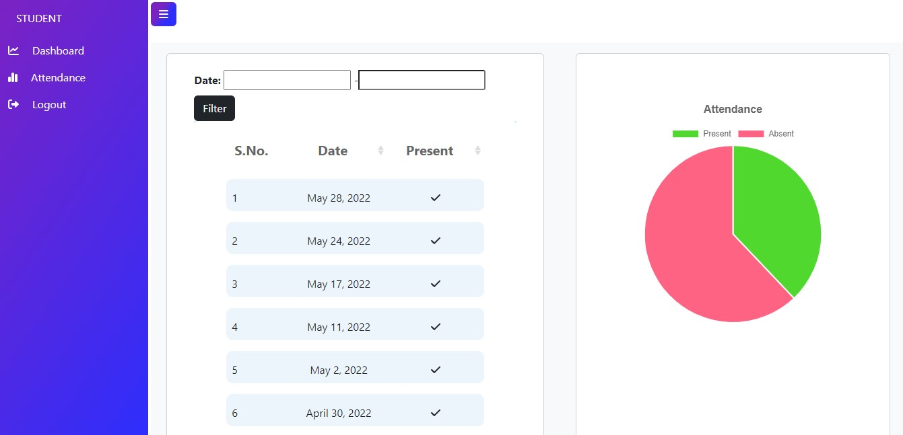

[](https://github.com/Minal-singh/SAMS/actions/workflows/SAMS.yml)

<div align="center">
  <h1>SAMS (Student Attendance Management System)</h1>
</div>

# Project [Demo](https://youtu.be/KAnLCyCZOEM) on YouTube

# Description
A web-based attendance management system utilizing face recognition with OpenCV and k-nearest neighbors (kNN). It features an admin interface, real-time data visualization via ChartJS, and a student login portal, ensuring high code quality with 89% test coverage.

# Features
## A. Admin Users Can:
1. **Register new student**: Add new students to the system with their details for attendance tracking.
2. **Manage Students (Update and Delete)**: Edit or remove student profiles as needed to keep the system up-to-date.
3. **View Student Attendance**: Access and monitor student attendance records in real-time.
4. **Create dataset for students**: Compile and generate datasets required for training the face recognition model.
5. **Train Model**: Train the face recognition model using the student dataset to improve attendance accuracy.
6. **Mark Attendance**: Automatically mark student attendance based on face recognition results.
7. **Export attendance sheet based on required filters**: Export attendance data by applying filters (e.g., date range, student name) for detailed reporting.
8. **Help student with password recovery**: Assist students in resetting or recovering their account passwords.

## B. Students Can:
1. **View Attendance**: Check their own attendance records through their login portal.
2. **Change password**: Update their password to maintain account security and privacy.

## 📸 ScreenShots

**Login Page**



**Admin Portal**

AdminDashboard

StudentsPage

AttendancePage

RegisterPage


**Student Portal**

StudentDashboard

StudentAttendancePage

# Tech Used
           


## How to Install and Run this project?

### Pre-Requisites:
- Install [Git](https://git-scm.com/) Version Control
- Install [Python](https://www.python.org/downloads/) Latest Version
- Install [Pip](https://pip.pypa.io/en/stable/installing/ ) (Package Manager)
*Alternative to Pip is Homebrew*

### Installation
**1. Create a Folder where you want to save the project**
**2. Create a Virtual Environment and Activate**
Install Virtual Environment First
```
pip install virtualenv
```
Create Virtual Environment

For Windows
```
virtualenv venv
```
Activate Virtual Environment

For Windows
```
venv\scripts\activate
```
**3. Clone this project**
```
git clone https://github.com/Minal-singh/SAMS
```
Then, Enter the project
```
cd SAMS
```
**4. Install Requirements from 'requirements.txt'**

For Windows
```
pip install https://github.com/Minal-singh/dlib/blob/master/dlib-19.23.0-cp39-cp39-win_amd64.whl?raw=true
pip install cmake
pip install -r requirements.txt
```
For Linux and Mac
```python
pip3 install -r requirements-linux.txt
```
**5. Collect Static**

Command for Windows:
```python
python manage.py collectstatic --no-input
```
**6. Now Run Server**

Command for Windows:
```python
python manage.py makemigrations main_app
python manage.py migrate
python manage.py runserver
```
**7. Login Credentials**

**Use Default Credentials**

*For Admin*

Email: admin@admin.com

Password: admin

*For Student*

Email: wmougeot0@businesswire.com

Password: password

**or create**

Create Super User

Command for Windows:
```
python manage.py createsuperuser
```

## Highlights
**Code Performance Optimization**
1. One time model training to reduce execution time.
2. Not storing attendance image to reduce memeory consumption.
3. Using default sqlite3 database of django to maintain database throughput and response time.

**Coding Best Practices**
1. Provided proper comments anywhere required, mostly in views.
2. Followed Python PEP8 convention for consistent indentation.
3. Maintained detailed naming convention that are self explanatory.
4. Implement the continuous integration using github actions.(CI/CD)
5. Test the application using python Unittest. Tests are not written for face recognition views as most of the part requires interaction with os and camera access.
6. The test coverage is 89% for the application.

**Functional Features**
1. Two type of user profiles- Admin and Student.
2. User authentication using email and password.
3. Student registration.
4. Student management (Update and Delete).
5. Dataset creation using opencv.
6. Model training using kNN model.
7. Mark Attendance using face recognition at real time.
8. Data visualization using chartjs.
9. Export excel - attendance data using xlwt pacakage.
10. Form validation.
11. Filter attendance according to branch, session , course or date.
12. Guide for FAQs.
